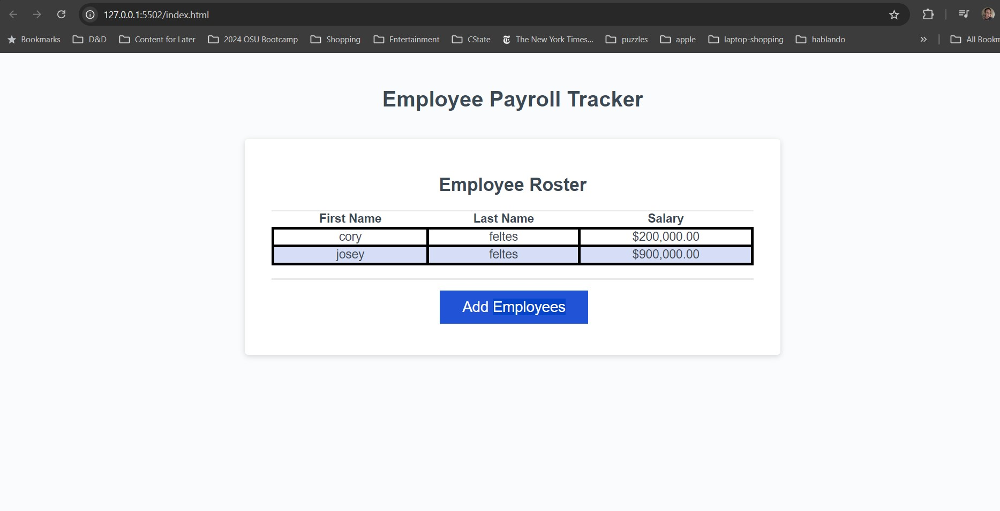

# homework-03-EmployeePayrollTracker

## Description
Third homework assignment - Employee Payroll Tracker

## Table of Contents
- [User-Story] (#User Story)
- [Acceptance-Criteria] (#Acceptance-Criteria)
- [Installation](#installation)
- [Usage](#usage)
- [Contributing](#contributing)
- [License](#license)
- [Acknowledgments](#acknowledgments)

## User Story
AS A payroll manager
I WANT AN employee payroll tracker
SO THAT I can see my employees' payroll data and properly budget for the company

## Acceptance-Criteria
GIVEN an employee payroll tracker
WHEN I click the "Add employee" button
THEN I am presented with a series of prompts asking for first name, last name, and salary
WHEN I finish adding an employee
THEN I am prompted to continue or cancel
WHEN I choose to continue
THEN I am prompted to add a new employee
WHEN I choose to cancel
THEN my employee data is displayed on the page sorted alphabetically by last name, and the console shows computed and aggregated data

## Installation
Step-by-step instructions on how to install and set up your project.

Creating a template 

## Usage
Instructions on how to use your application.

Visit my sites here!
https://cfeltes.github.io/homework-03-EmployeePayrollTracker/
https://github.com/CFeltes/homework-03-EmployeePayrollTracker.git
git@github.com:CFeltes/homework-03-EmployeePayrollTracker.git

## Contributing
Guidelines for contributing to the project.
Contributors were the author of the source code, AI, help from the program's tutors, and owner of this repository (Cory Feltes) 

## License
This project is licensed under the MIT License - see the [LICENSE.md](LICENSE.md) file for details.

## Acknowledgments
Used syllabus/course resources as well as AI resources to check my work.

## Contact Information
Cory Feltes - cory.feltes@gmail.com

//Make sure to keep your README updated as your project evolves!